# Keycloak OIDC Auth Server

Demo completa de autenticación que actúa como puente entre una API legacy y Supabase, usando Keycloak para token exchange con Hono.js.

## 🎯 Objetivo

Desarrollar un sistema que permita:
1. Autenticar usuarios con credenciales legacy (email/password)
2. Intercambiar tokens legacy por tokens OIDC usando Keycloak
3. Crear sesiones en Supabase solo para usuarios ya existentes (sin auto-provisionar)
4. Operar sin migrar usuarios del sistema legacy a Keycloak inmediatamente

## 🛠 Stack Tecnológico

- **Backend**: Hono.js con TypeScript
- **Autenticación Legacy**: JWT custom
- **Bridge**: Keycloak (instancia en la nube) con Token Exchange OAuth 2.0
- **Base de datos moderna**: Supabase (Auth)
- **Validación**: Zod schemas
- **Deployment**: Node.js server

## 🔑 Credenciales de Demo

- **Email**: `xaguas@allient.io`
- **Password**: `mK9a5T6NhYfqWy`

> ⚠️ **Importante**: Estas credenciales son solo para el mock legacy. Para la parte de Supabase, el usuario con ese email debe existir previamente en Supabase; si no existe, el flujo retornará `USER_NOT_FOUND_IN_SUPABASE`.

## 🚀 Instalación y Configuración

### 1. Instalar dependencias

```bash
npm install
```

### 2. Configurar variables de entorno

Copia el archivo de ejemplo y configura las variables:

```bash
cp env.example .env
```

Edita el archivo `.env` con tus credenciales:

```env
# Puerto del servidor
PORT=3000

# Configuración de Keycloak
KEYCLOAK_BASE_URL=https://your-keycloak-instance.com
KEYCLOAK_REALM=your-realm
KEYCLOAK_CLIENT_ID=your-client-id
KEYCLOAK_CLIENT_SECRET=your-client-secret
KEYCLOAK_ADMIN_USERNAME=admin
KEYCLOAK_ADMIN_PASSWORD=admin-password

# Configuración de Supabase
SUPABASE_URL=https://your-project.supabase.co
SUPABASE_SERVICE_ROLE_KEY=your-service-role-key

# JWT Secret para tokens legacy
JWT_SECRET=your-super-secret-jwt-key-for-legacy-tokens

# Configuración de CORS
CORS_ORIGIN=http://localhost:3000
```

### 3. Ejecutar en desarrollo

```bash
npm run dev
```

### 4. Compilar para producción

```bash
npm run build
npm start
```

## 📡 Endpoints Disponibles

### Información General
- `GET /` - Información del servidor
- `GET /health` - Salud del servidor

### API Legacy (Simulada)
- `POST /api/legacy/login` - Login con credenciales legacy
- `GET /api/legacy/validate` - Validar token legacy (via Authorization header)
- `POST /api/legacy/validate-token` - Validar token legacy (via body)

### Bridge Keycloak
- `POST /api/bridge/token-exchange` - Intercambiar token legacy por tokens OIDC
- `POST /api/bridge/validate-keycloak-token` - Validar token de Keycloak
- `GET /api/bridge/health` - Salud de la conexión con Keycloak

### Supabase Integration
- `POST /api/supabase/check-user` - Verificar si usuario existe en Supabase
- `POST /api/supabase/create-session` - Crear sesión en Supabase
- `POST /api/supabase/validate-session` - Validar sesión de Supabase
- `GET /api/supabase/health` - Salud de la conexión con Supabase

### Flujo Completo
- `POST /api/auth/complete-flow` - **Flujo end-to-end completo**
- `POST /api/auth/validate-legacy` - Validar solo credenciales legacy
- `GET /api/auth/health` - Salud de todos los servicios
- `GET /api/auth/demo-credentials` - Obtener credenciales de demo

## 🔄 Flujo de Autenticación

### Flujo Completo End-to-End

```mermaid
sequenceDiagram
    participant Client
    participant LegacyAPI
    participant Keycloak
    participant Supabase
    participant AuthServer

    Client->>AuthServer: POST /api/auth/complete-flow
    AuthServer->>LegacyAPI: Validar credenciales
    LegacyAPI-->>AuthServer: Token legacy
    AuthServer->>Keycloak: Token exchange
    Keycloak-->>AuthServer: Tokens OIDC
    AuthServer->>Supabase: Verificar usuario existe
    Supabase-->>AuthServer: Usuario encontrado
    AuthServer->>Supabase: Crear sesión
    Supabase-->>AuthServer: Sesión creada
    AuthServer-->>Client: Respuesta completa
```



### Pasos del Flujo

1. **Autenticación Legacy**: Valida credenciales contra sistema legacy
2. **Token Exchange**: Intercambia token legacy por tokens OIDC de Keycloak
3. **Verificación Supabase**: Verifica que el usuario existe en Supabase
4. **Creación de Sesión**: Crea sesión en Supabase solo si el usuario existe

## 📝 Ejemplos de Uso

### 1. Flujo Completo de Autenticación

```bash
curl -X POST http://localhost:3000/api/auth/complete-flow \
  -H "Content-Type: application/json" \
  -d '{
    "email": "xaguas@allient.io",
    "password": "mK9a5T6NhYfqWy"
  }'
```

**Respuesta exitosa:**
```json
{
  "success": true,
  "message": "Flujo de autenticación completado exitosamente",
  "data": {
    "supabaseSession": {
      "access_token": "supabase_...",
      "refresh_token": "refresh_...",
      "expires_in": 3600,
      "token_type": "bearer",
      "user": {
        "id": "user-id",
        "email": "xaguas@allient.io",
        "created_at": "2024-01-01T00:00:00Z",
        "updated_at": "2024-01-01T00:00:00Z"
      }
    },
    "keycloakTokens": {
      "access_token": "eyJ...",
      "id_token": "eyJ...",
      "refresh_token": "eyJ...",
      "token_type": "Bearer",
      "expires_in": 300
    }
  }
}
```

**Respuesta si usuario no existe en Supabase:**
```json
{
  "success": false,
  "message": "Usuario no encontrado en Supabase. El usuario debe existir previamente.",
  "error": "USER_NOT_FOUND_IN_SUPABASE"
}
```

### 2. Login Legacy Individual

```bash
curl -X POST http://localhost:3000/api/legacy/login \
  -H "Content-Type: application/json" \
  -d '{
    "email": "xaguas@allient.io",
    "password": "mK9a5T6NhYfqWy"
  }'
```

### 3. Token Exchange con Keycloak

```bash
curl -X POST http://localhost:3000/api/bridge/token-exchange \
  -H "Content-Type: application/json" \
  -d '{
    "legacyToken": "eyJ..."
  }'
```

### 4. Verificar Usuario en Supabase

```bash
curl -X POST http://localhost:3000/api/supabase/check-user \
  -H "Content-Type: application/json" \
  -d '{
    "email": "xaguas@allient.io"
  }'
```

## 🔧 Configuración de Keycloak

### Requisitos

1. **Instancia de Keycloak** configurada y accesible
2. **Realm** creado
3. **Client** configurado con:
   - Client ID y Secret
   - Grant types: `password`, `urn:ietf:params:oauth:grant-type:token-exchange`
   - Service accounts habilitado

### Configuración del Client

```json
{
  "clientId": "your-client-id",
  "enabled": true,
  "serviceAccountsEnabled": true,
  "standardFlowEnabled": true,
  "directAccessGrantsEnabled": true,
  "protocol": "openid-connect",
  "attributes": {
    "token.exchange": "true"
  }
}
```

## 🔧 Configuración de Supabase

### Requisitos

1. **Proyecto Supabase** creado
2. **Service Role Key** obtenida
3. **Usuario de prueba** creado manualmente con email `xaguas@allient.io`

### Crear Usuario de Prueba

```sql
-- En la consola SQL de Supabase
INSERT INTO auth.users (
  id,
  email,
  encrypted_password,
  email_confirmed_at,
  created_at,
  updated_at
) VALUES (
  gen_random_uuid(),
  'xaguas@allient.io',
  crypt('password123', gen_salt('bf')),
  now(),
  now(),
  now()
);
```

## 🚨 Códigos de Error

| Código | Descripción |
|--------|-------------|
| `INVALID_CREDENTIALS` | Credenciales legacy inválidas |
| `TOKEN_EXPIRED` | Token legacy expirado |
| `TOKEN_INVALID` | Token legacy inválido |
| `KEYCLOAK_ERROR` | Error en comunicación con Keycloak |
| `USER_NOT_FOUND_IN_SUPABASE` | Usuario no existe en Supabase |
| `SUPABASE_ERROR` | Error en comunicación con Supabase |
| `VALIDATION_ERROR` | Error de validación de datos de entrada |

## 🧪 Testing

### Health Checks

```bash
# Verificar salud general
curl http://localhost:3000/health

# Verificar salud de todos los servicios
curl http://localhost:3000/api/auth/health

# Verificar salud de Keycloak
curl http://localhost:3000/api/bridge/health

# Verificar salud de Supabase
curl http://localhost:3000/api/supabase/health
```

### Obtener Credenciales de Demo

```bash
curl http://localhost:3000/api/auth/demo-credentials
```

## 📁 Estructura del Proyecto

```
src/
├── config/           # Configuración y variables de entorno
├── services/         # Servicios de negocio
│   ├── legacyAuth.ts      # Autenticación legacy
│   ├── keycloakService.ts # Integración con Keycloak
│   ├── supabaseService.ts # Integración con Supabase
│   └── authFlowService.ts # Orquestador del flujo completo
├── routes/           # Rutas de la API
│   ├── legacy.ts          # Endpoints legacy
│   ├── keycloak.ts        # Endpoints de Keycloak
│   ├── supabase.ts        # Endpoints de Supabase
│   └── auth.ts            # Endpoints del flujo completo
├── types/            # Tipos TypeScript y schemas Zod
└── index.ts          # Punto de entrada de la aplicación
```

## 🔒 Seguridad

- **Tokens JWT** firmados con secret seguro
- **Validación de entrada** con Zod schemas
- **CORS** configurado apropiadamente
- **Service Role** para Supabase (solo operaciones administrativas)
- **Admin API** de Keycloak con autenticación segura

## 🚀 Deployment

### Variables de Entorno Requeridas

Asegúrate de configurar todas las variables de entorno antes del deployment:

```bash
# Validar configuración
npm run type-check
```

### Docker (Opcional)

```dockerfile
FROM node:18-alpine
WORKDIR /app
COPY package*.json ./
RUN npm ci --only=production
COPY dist ./dist
EXPOSE 3000
CMD ["npm", "start"]
```

## 📄 Licencia

MIT License

## 👨‍💻 Autor

Xavier Aguas - [xaguas@allient.io](mailto:xaguas@allient.io)